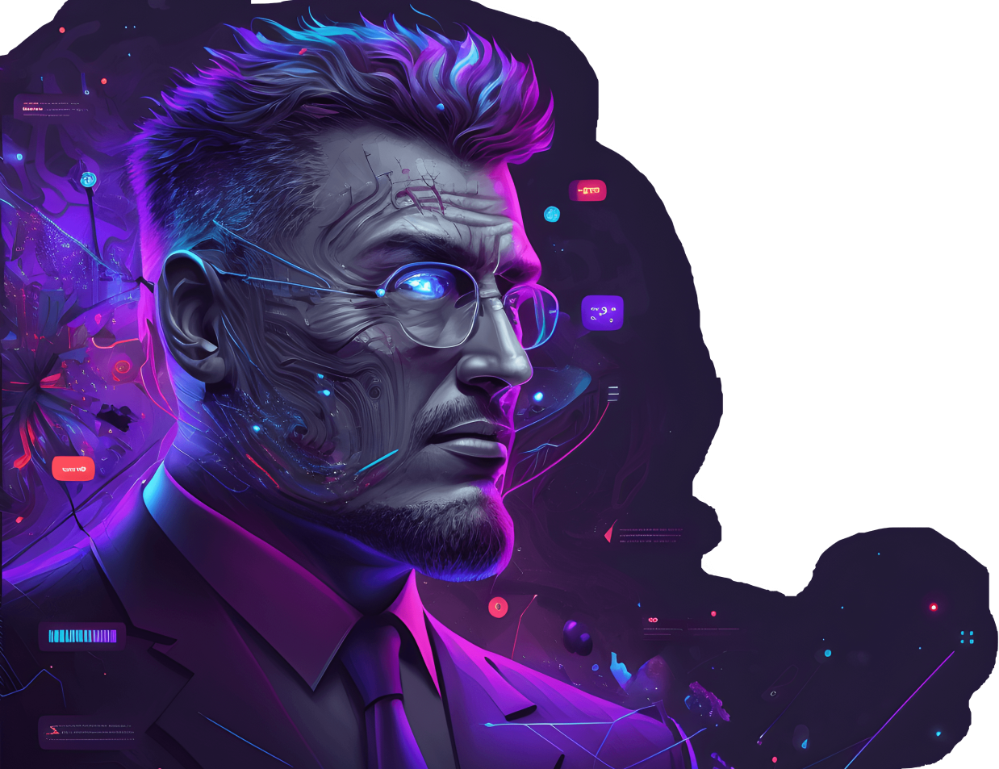

# AI-UI Portfolio Experiment

An early portfolio experiment created shortly after Midjourney made AI image generation accessible to individual designers.

This project captures a specific moment in AI and design history: when custom visual worlds suddenly became accessible without needing a full illustration, photography, or 3D pipeline.

The result is intentionally dramatic, cyberpunk, and very much a product of the early Midjourney era.

## Live Site

https://ai-ui-c0f48.web.app/

## Figma Community Template

https://www.figma.com/community/file/1201747719279089009/portfolio-figma-template

## What this project explores

* AI-generated visual identity
* Portfolio storytelling
* Experimental UI direction
* Webpack / SCSS frontend architecture
* Using Midjourney as part of a design concepting workflow

## Why it matters

Looking back, this project feels like a time capsule.

It represents the moment when AI image generation started changing how designers explored mood, style, identity, and visual direction.

Not a current portfolio.
Not a product.

A snapshot of the first wave of accessible AI image generation and the creative experimentation that followed.

## Tech

* HTML
* SCSS
* JavaScript
* Webpack
* Firebase Hosting
